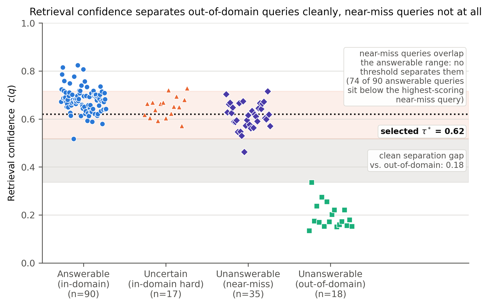

# Confidence-Gated Abstention for Reducing Hallucination in RAG

An empirical study of a simple question: **can a retriever's own similarity
score tell a RAG system when to keep quiet?**

The mechanism is deliberately plain — average the top-*k* similarity scores,
and refuse to answer if that average falls below a threshold τ. The work is in
measuring it properly: scoring the abstention *decision* against ground truth
rather than reporting a bare abstain rate, and choosing τ by an explicit rule
rather than by eye.

---

## Motivation

RAG is supposed to stop a language model making things up. Mostly it does —
but most RAG systems still answer when retrieval has returned nothing useful,
and nothing in the output distinguishes a grounded answer from a fabricated
one. Letting the system decline is the obvious alternative. The question is
how well a raw similarity score can drive that decision.

---

## Headline results

Corpus: 62 Wikipedia pages on the Indian Premier League → 823 sections → 2,732
passages. Query set: 160 hand-labelled queries, each marked `answerable`,
`unanswerable`, or `uncertain` against that corpus. Crucially, the
unanswerable set contains two kinds of query: 18 that are plainly off-topic,
and 35 **near-miss** queries that are about the IPL but ask for something the
corpus does not hold.

**RAG with abstention vs. the same model with no context** (τ\* = 0.62):

| Metric | RAG | Baseline |
|---|---:|---:|
| Faithfulness (1–5) | **4.44** | **2.19** |
| Faithfulness (answered only) | 4.18 | — |
| Unfaithful answers (faithfulness < 3) | **7 / 84** | **99 / 160** |
| Relevance (all 160) | 3.08 | 4.23 |
| Relevance (answered only, n=109) | 4.06 | — |
| Abstain rate | 31.9 % | 0 % |

The baseline wins on raw relevance precisely because it answers everything,
including the 53 questions it cannot possibly ground — which is the behaviour
faithfulness is there to catch.

**The abstention decision** at τ\* = 0.62, over the 143 labelled queries:
precision 0.83, recall 0.72, F1 0.77, specificity 0.91, accuracy 0.84,
MCC 0.65 (TP=38, FP=8, TN=82, FN=15).

---

## Three findings worth the paper

**1. Near-miss queries defeat the confidence gate; off-topic ones do not.**
Out-of-domain queries score 0.135–0.336 against 0.517–0.824 for answerable
ones — a clean gap of 0.18, and the gate abstains on 100 % of them. Near-miss
queries score 0.462–0.715 and sit *inside* the answerable range: 74 of the 90
answerable queries fall below the highest-scoring near-miss query, so no
scalar threshold separates the two classes. The gate catches only 57 % of
them. Retrieval similarity measures topical proximity, and a near-miss query
is topically proximate by construction.

**2. There is a genuine coverage–reliability tradeoff.**
Recall climbs monotonically with τ (0.00 at 0.10 → 0.72 at 0.62 → 1.00 at
0.75) while precision falls (1.00 at τ ≤ 0.50 → 0.38 at 0.80), producing a
real optimum at τ\* = 0.62 rather than a plateau. An earlier run over a corpus
with no near-miss queries showed recall pinned at 1.00 and looked like pure
"precision decay"; that was a property of the query set, not of the method.

**3. The gate is far better than chance, but not close to solved.**
Against a random abstention baseline matched to the same abstain count
(100 trials), the gate scores F1 0.77 vs 0.35 and MCC 0.65 vs 0.00. It is
doing real work. It also leaves 15 unanswerable queries answered and 7
unfaithful answers among 84 substantive ones. Rank-weighting the similarity
scores (0.5/0.3/0.2) or taking the max instead of the mean does not help:
F1 0.74 and 0.75 respectively, against 0.77 for the plain mean.

There is also a **second refusal channel**: 25 of the 109 queries the gate let
through were declined by the generator itself, concentrated in exactly the
categories the gate handles worst (12 near-miss, 7 in-domain-hard). The gate
catches *topic absence*; the generator catches *question specificity*.




---

## How to run it

```bash
python -m venv venv && venv\Scripts\activate      # Windows
pip install -r requirements.txt
cp .env.example .env                              # add your GROQ_API_KEY

python src/scrape.py            # build the corpus      (network)
python src/preprocess.py        # chunk it
python src/experiments.py       # run every query once  (API calls; resumable)
python src/select_threshold.py  # sweep tau, select tau*
python src/analyze.py           # every number in the tables
python src/plot.py              # Figure 1
python src/plot_threshold.py    # Figure 2
python src/plot_confidence.py   # Figure 3
```

`experiments.py` is the **only** script that calls the API. It throttles
itself under the per-minute token ceiling and is resumable — queries already
in `results/per_query.json` are skipped, so a rate limit costs you one query,
not the run. Everything downstream reads cached results and is free to re-run.

### Judge validation

```bash
python src/judge_validation.py --worksheet 15   # emit a blank rating sheet
#   ... fill in data/human_ratings.json by hand ...
python src/judge_validation.py                  # MAE, exact match, r, rho, kappa_w
```

**Status: not yet done.** The worksheet exists and the statistics are
implemented and checked against `scipy`/`sklearn`; they have nothing to run on
until a human rates the items.

---

## Design decisions worth knowing about

**The sweep is derived, not re-run.** Retrieval and generation do not depend
on τ — the same query retrieves the same passages and produces the same answer
at every threshold. So each query is run once and the whole sweep is computed
by masking on cached confidence scores. This is ~*k* times cheaper, and it
makes the sweep exact: re-judging at each threshold lets judge nondeterminism
move the faithfulness column independently of the variable under study.

**Refusals are not hallucinations.** A refusal asserts nothing, so it is
excluded from both the numerator and denominator of the hallucination rate,
for RAG and baseline alike. This matters here: the judge scores the identical
string `"I don't know."` as faithfulness 1 on nine queries and 5 on three
others. Leaving refusals in would have reported 2 hallucinations instead of 1.

**Inner product, not L2.** The index is `faiss.IndexFlatIP` over L2-normalised
embeddings, so the score *is* cosine similarity — higher is better, and no
distance-to-similarity transform is applied. (Earlier documentation called it
"FAISS (L2)", which implies the opposite ordering.)

**Retrieval preserves rank order.** Results used to be deduplicated through a
Python `set`, which destroyed the ranking and varied between processes because
string hashing is randomised per interpreter. MRR@k is meaningless without the
fix, and results were not reproducible despite the docs claiming they were.

---

## Layout

```
src/
├── config.py            every setting for a run, in one place
├── scrape.py            Wikipedia -> data/raw_dataset.json
├── preprocess.py        sections -> overlapping chunks
├── retriever.py         embeddings + FAISS index + top-k retrieval
├── llm.py               throttled Groq client with retry
├── generator.py         RAG and no-context generation
├── evaluate.py          LLM judge + retrieval metrics
├── metrics.py           abstention confusion matrix, MCC, hallucination rate
├── experiments.py       run every query once      (the only API caller)
├── select_threshold.py  sweep tau, select tau*
├── analyze.py           produces every reported number
├── judge_validation.py  judge vs human agreement
└── plot*.py             Figures 1-3

data/     raw_dataset.json, chunks.json, queries.json, human_ratings.json
results/  per_query.json (the cache), paper_numbers.json (the tables), figures
docs/     methodology.md, experiments.md, results.md
```

`results/per_query.json` is the source of truth: every reported number is
derived from it, and it records the exact answer and score behind each one.

---

## Limitations

Stated in full in [docs/results.md](docs/results.md#9-limitations). The short
version: one small domain, n = 30, a single run with no confidence intervals,
out-of-domain queries that are unambiguous by construction, an uncalibrated
confidence score, a faithfulness rubric that is partly circular by design and
undefined for refusals, and no human validation yet.

---

## License

MIT — see [LICENSE](LICENSE).

## Author

Harsh Srivastava — https://github.com/harshs16
