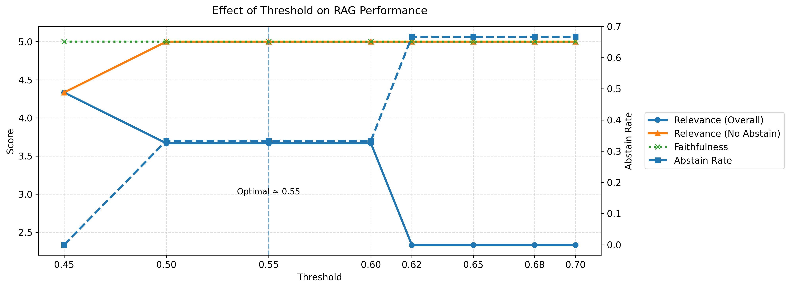

# Results and Analysis

This section summarizes the results obtained from the experiments.

---

## 1. RAG vs Baseline

| Metric       | RAG  | Baseline |
|-------------|------|----------|
| Relevance    | 3.0  | 3.0      |
| Faithfulness | 5.0  | 3.66     |

### Observation

- RAG improves faithfulness significantly
- Answers are more grounded in retrieved context
- Relevance remains similar due to limited dataset

---

## 2. Retrieval Quality

Hit@k ≈ 0.66

### Interpretation

- Correct information is retrieved in ~66% of cases
- Retrieval failures directly impact answer quality

---

## 3. Threshold Experiment

The following plot summarizes performance:

---

## 4. Coverage vs Reliability

- Low threshold:
  - High coverage (answers most queries)
  - Lower reliability

- High threshold:
  - High abstention
  - Higher reliability

This shows a clear tradeoff.

---

## 5. Abstain Rate

| Threshold | Abstain Rate |
|----------|-------------|
| 0.45     | ~0.0        |
| 0.55     | ~0.33       |
| 0.70     | ~0.66       |

### Insight

Increasing threshold makes the system more conservative.

---

## 6. Effective Relevance

Effective relevance remains ~5.0 across thresholds.

### Interpretation

- When the model answers, it produces high-quality responses
- Poor responses are avoided through abstention

---

## 7. Overall Relevance

- Highest at low thresholds (~4.3)
- Drops at higher thresholds (~2.3)

### Reason

- Increased abstention reduces number of evaluated responses

---

## 8. Optimal Threshold

Empirically observed:
Optimal threshold ≈ 0.55

This provides a balance between:
- Answer coverage
- Answer quality

---

## 9. Key Findings

1. RAG improves grounding compared to baseline  
2. Retrieval quality is the main bottleneck  
3. Abstention reduces hallucination risk  
4. There is a measurable tradeoff between coverage and reliability  

---

## 10. Limitations

- Small dataset size  
- Limited number of queries  
- Evaluation uses LLM scoring  
- No reranking or hybrid retrieval  

---

## 11. Conclusion

The experiments show that:

- RAG alone is not sufficient for reliability  
- Retrieval quality directly impacts generation quality  
- Abstention is an effective mechanism to control hallucinations  
- Proper threshold tuning is critical for system performance